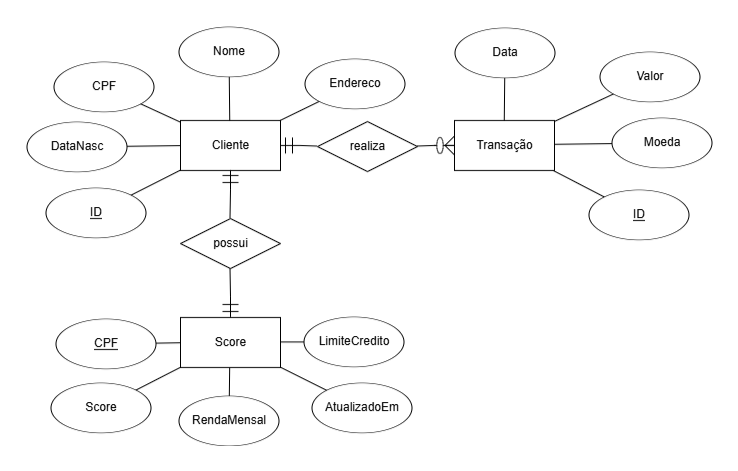
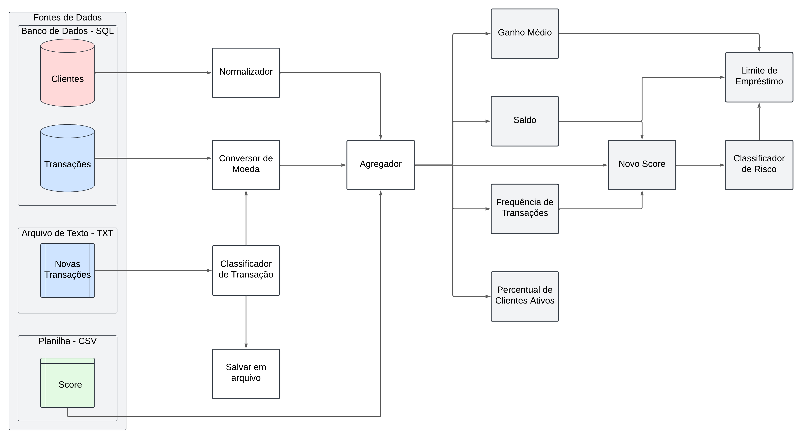

# Gym_Pipeline_Framework_CE

Aplicação prática dos conhecimentos adquiridos na matéria de Computação Escalável. Ao fim do projeto teremos um framework funcional "from scratch" e um projeto prático de demonstração.

## Descrição

Este projeto implementa um framework de processamento de dados escalável, com arquitetura baseada em nós `HandlerNode`, seguindo a lógica de produtor-consumidor. Ele permite a construção de pipelines com extração, transformação e carga de dados de forma modular.

## ✅ Requisitos

- Python >= 3.7
- [faker](https://pypi.org/project/Faker/)

Instale os requisitos com:

```bash
pip install -r requirements.txt
```

Ou manualmente:

```bash
pip install faker
```

## Como Usar

### 1. Crie seus handlers

Você pode criar seus próprios handlers herdando de `BaseHandler`. Por exemplo:

```python
from gym_framework.handlers.base_handler import BaseHandler

class MeuHandler(BaseHandler):
    def handle(self, data):
        # lógica de processamento
        return data
```

### 2. Construa o pipeline

```python
from gym_framework.core.pipeline import Pipeline
from gym_framework.handlers import MeuHandler, OutroHandler

pipeline = Pipeline()
pipeline.add_handler("início", MeuHandler())
pipeline.add_handler("fim", OutroHandler(), depends_on=["início"])
pipeline.run()
```


### 🗂 Exemplo Pronto

Um exemplo funcional do uso do pipeline já está disponível no arquivo:

```
gym_framework/core/pipeline.py
```

Esse arquivo demonstra como criar handlers, conectá-los em sequência e executar o pipeline completo. 

## 🧠 Modelo Entidade-Relacionamento



## 🔄 Fluxo do Pipeline



---

## 📁 Estrutura do Projeto

```
gym_framework/
├── core/          # Núcleo do framework (pipeline, dataframe, etc.)
├── docs/          # Documentos
├── handlers/      # Handlers (processadores de dados)
├── extractors/    # Ferramentas para extração de dados
├── loaders/       # Ferramentas para carregamento de dados
├── sources/       # Fontes de dados
```


## 👨‍💻 Autores

- George
- Yoni 
- Mikael   