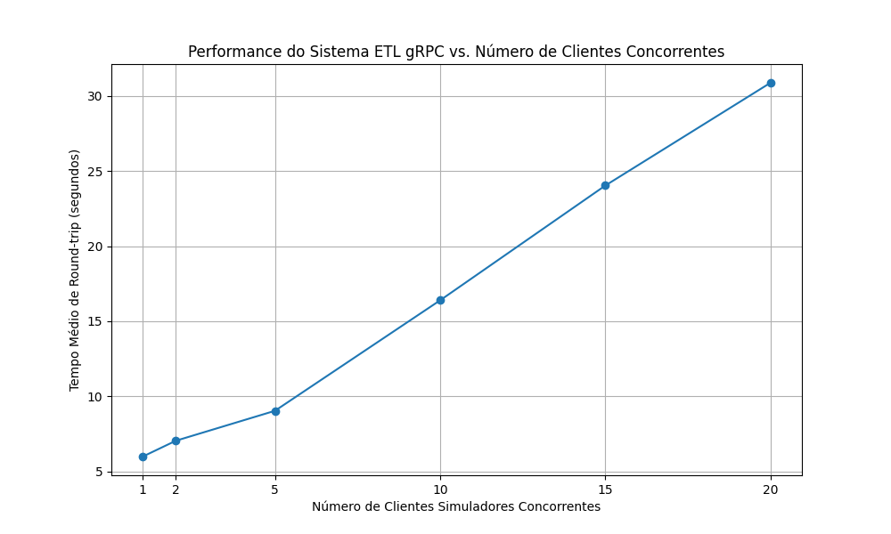

# Relatório da Evolução do Framework ETL para gRPC e Teste de Carga

## Introdução

Este relatório detalha as modificações realizadas no Gym_Pipeline_Framework_CE para substituir o mecanismo de ingestão de dados baseado em arquivos por um sistema baseado em gRPC. Adicionalmente, descreve a estrutura do novo sistema cliente-servidor e apresenta uma análise dos resultados do teste de carga efetuado.

## Mudanças Realizadas no Projeto

*   **Definição do Serviço gRPC:**
    *   Foi criado um arquivo `.proto` (`gym_framework/protos/event_ingestion_service.proto`) para definir o serviço de ingestão de eventos.
    *   Este arquivo especifica as mensagens de dados (`ClientData`, `TransactionData`, `ScoreData`) e a resposta (`IngestionResponse`), espelhando os campos de dados existentes no framework.
    *   Foi definido o serviço `EventIngestionService` com os métodos RPC: `IngestClient`, `IngestTransaction`, e `IngestScore`.

*   **Geração de Código gRPC:**
    *   Os stubs de cliente e servidor gRPC (`event_ingestion_service_pb2.py` e `event_ingestion_service_pb2_grpc.py`) foram gerados a partir do arquivo `.proto` e colocados no diretório `gym_framework`.

*   **Desenvolvimento do Servidor gRPC Principal (`gym_framework/rpc_server.py`):**
    *   Um servidor gRPC completo foi implementado.
    *   Este servidor implementa a lógica para os métodos definidos no `EventIngestionServiceServicer`.
    *   Ele recebe as mensagens protobuf dos clientes, converte-as para dicionários Python.
    *   Crucialmente, ele instancia e utiliza o `PipelineExecutor` do framework ETL da A1. Um `event_id` (geralmente gerado pelo servidor ou propagado se fornecido pelo cliente) é associado a cada evento.
    *   O servidor encaminha os dados (como dicionários, incluindo o `event_id`) para os handlers produtores apropriados, que foram adaptados para iniciar o processamento do pipeline.
    *   Retorna uma `IngestionResponse` ao cliente, indicando o sucesso e o `event_id`.

*   **Adaptação dos Handlers Produtores (`gym_framework/handlers/producer.py`):**
    *   Os handlers produtores existentes (ex: `ScoreCSVProducerHandler`, `ClientsDBProducerHandler`, `NewTransactionsTXTProducerHandler`) foram modificados.
    *   O método `handle(self, data)` agora aceita tanto um caminho de arquivo (como antes) quanto um dicionário (payload do evento gRPC).
    *   Um `event_id` é adicionado como uma coluna ao `DataFrame` produzido, garantindo o rastreamento do evento através do pipeline.

*   **Desenvolvimento do Simulador de Cliente gRPC e Scripts de Teste de Carga:**
    *   Um script cliente gRPC inicial (`gym_framework/tests/grpc_client_simulator.py`) foi criado para enviar dados de teste ao servidor.
    *   Para o teste de carga, este cliente foi utilizado como base para `run_load_test.py`. Este script é responsável por:
        *   Gerar dados de teste (`ClientData`, `TransactionData`, `ScoreData`).
        *   Enviar esses dados para o servidor gRPC (`rpc_server.py`).
        *   Registrar timestamps de envio e recebimento para calcular o tempo de round-trip.
        *   Gerar logs com essas informações para processamento posterior.
    *   Um script de orquestração de teste de carga (`orchestrate_load_test.py`) foi desenvolvido para:
        *   Executar o `run_load_test.py` com um número variado de instâncias de clientes concorrentes (ex: 1, 2, 5, 10, 15, 20).
        *   Gerenciar diretórios de logs para cada execução de teste.
        *   Chamar um script de processamento de logs (`process_logs.py`) para calcular métricas como o tempo médio de round-trip.
        *   Coletar os resultados de tempo médio para cada contagem de clientes.
    *   Um script `process_logs.py` foi usado para analisar os arquivos de log e extrair/calcular as métricas de desempenho.

*   **Execução do Teste de Carga e Geração de Resultados:**
    *   Os testes de carga foram executados com o servidor gRPC (`rpc_server.py`) rodando e o `orchestrate_load_test.py` gerenciando os clientes simuladores.
    *   Os resultados foram coletados e usados para gerar um gráfico (`load_test_performance_graph.png`), visualizando o tempo médio de round-trip em função do número de clientes concorrentes.

## Estrutura do Novo Sistema Cliente-Servidor gRPC

O sistema agora opera com uma arquitetura cliente-servidor baseada em gRPC:

1.  **Clientes Simuladores (Controlados por `run_load_test.py`):**
    *   **Geração de Dados:** Simulam a chegada de novos dados.
    *   **Comunicação gRPC:** Estabelecem conexão com o servidor, serializam dados em protobuf, invocam RPCs.
    *   **Medição de Tempo:** Registram timestamps para calcular o tempo de round-trip.
    *   **Logging:** Registram `event_id` e tempo de round-trip.
    *   **Concorrência:** Múltiplas instâncias são lançadas para gerar carga.

2.  **Servidor gRPC (`rpc_server.py` - Integrado ao Pipeline ETL):**
    *   **Ponto de Entrada:** Novo ponto de entrada de dados para o ETL.
    *   **Serviço gRPC:** Implementa `EventIngestionServiceServicer`.
        *   Ouve chamadas RPC.
        *   **Deserialização:** Converte protobuf para dicionários.
        *   **`event_id`:** Gera/obtém `event_id` para rastreamento.
        *   **Integração com Pipeline:** Prepara dados para handlers, que usam `DictSource` e incluem `event_id` no `DataFrame`. O `PipelineExecutor` processa os dados.
        *   **Resposta ao Cliente:** Envia `IngestionResponse` com `event_id` e status.

## Interpretação do Gráfico de Teste de Carga



O gráfico "Performance do Sistema ETL gRPC vs. Número de Clientes Concorrentes" (conforme imagem fornecida) apresenta o tempo médio de round-trip (eixo Y, em segundos) em função do número de clientes simuladores concorrentes (eixo X).

Este tipo de análise é crucial para entender a capacidade do sistema e planejar futuras otimizações ou ajustes de infraestrutura.

*   **Tendência Geral:** O gráfico mostra que o tempo médio de round-trip aumenta à 
medida que o número de clientes concorrentes aumenta. A linha conecta os pontos de dados 
(1, ~6s), (2, ~7s), (5, ~9s), (10, ~16.5s), (15, ~24s), (20, ~31s).
*   **Escalabilidade:**
    *   **Aumento Linear Suave (Inicial):** Para um número baixo de clientes (de 1 a 5), 
    o aumento no tempo de round-trip é relativamente pequeno, passando de aproximadamente 
    6 segundos para 9 segundos. Isso sugere que o sistema lida bem com cargas leves, e os 
    recursos do servidor (CPU, memória, I/O, capacidade de processamento do pipeline) são 
    suficientes para atender a essas requisições sem grande degradação.
    *   **Aumento Mais Acentuado (Intermediário para Alto):** Conforme o número de 
    clientes aumenta para 10, 15 e 20, o tempo de round-trip cresce de forma mais 
    significativa. De 5 para 10 clientes, o tempo salta de ~9s para ~16.5s. De 10 para 20 
    clientes, o tempo quase dobra novamente, de ~16.5s para ~31s. Esta aceleração na taxa 
    de aumento do tempo de resposta indica que o sistema está se aproximando de um ponto 
    de saturação ou encontrando gargalos.
*   **Possíveis Gargalos:** O aumento no tempo de processamento pode ser devido a 
diversos fatores à medida que a carga aumenta:
    *   **Recursos do Servidor:** Limitações de CPU, memória, I/O (disco ou rede) no 
    servidor que hospeda o `rpc_server.py`.
    *   **Processamento do Pipeline:** O próprio pipeline ETL pode ter etapas que se 
    tornam gargalos sob carga (ex: transformações complexas, escrita em banco de dados, 
    operações bloqueantes). A concorrência interna do pipeline (uso de multiprocessing) 
    pode estar atingindo seus limites ou introduzindo overhead.
    *   **gRPC Server Overhead:** Embora gRPC seja eficiente, um número muito alto de 
    conexões e requisições concorrentes pode impor algum overhead ao próprio servidor 
    gRPC em termos de gerenciamento de threads/processos e serialização/deserialização.
    *   **Locking/Contenção:** Se houver recursos compartilhados (arquivos, conexões de 
    banco de dados, estruturas de dados em memória) que exigem locks, a contenção por 
    esses locks aumentará com mais clientes, levando a esperas.

## Instruções para Rodar o Teste de Carga

Para executar o teste de carga no sistema ETL gRPC, siga os passos abaixo:

**1. Pré-requisitos:**
*   **Ambiente Python:** Certifique-se de ter o Python 3.x instalado.
*   **Dependências:** Instale as bibliotecas Python necessárias. Utilize
 (`pip install -r requirements.txt`).

**2. Iniciar o Servidor gRPC:**
*   Abra um terminal.
*   Navegue até o diretório raiz do projeto `Gym_Pipeline_Framework_CE`.
*   Execute o servidor gRPC com o seguinte comando:
    ```bash
    python -m gym_framework.rpc_server
    ```
*   Mantenha este terminal em execução. O servidor estará ouvindo por conexões gRPC.

**3. Executar o Orquestrador do Teste de Carga:**
*   Abra um **novo** terminal.
*   Navegue até o diretório raiz do seu projeto `Gym_Pipeline_Framework_CE`.
*   Execute o script de orquestração do teste:
    ```bash
    python orchestrate_load_test.py
    ```
*   O script irá automaticamente:
    *   Executar o `run_load_test.py` para diferentes contagens de clientes simuladores (conforme definido em `CLIENT_COUNTS_TO_TEST` dentro do `orchestrate_load_test.py`).
    *   Criar um diretório `load_test_logs` temporário para os logs de cada cliente durante uma execução, e depois mover esses logs para `load_test_run_results/logs_<N>_clients/`.
    *   Chamar `process_logs.py` para analisar os logs e calcular o tempo médio de round-trip para cada configuração.
    *   Imprimir os resultados no console.
 
